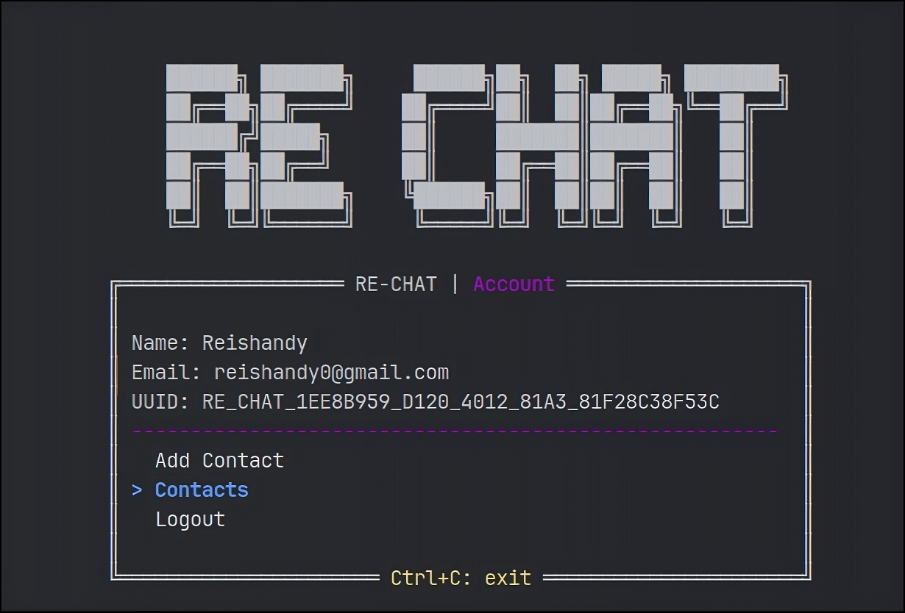

# ReChat Python Client



ReChat is a Python client for the [ReChat API](https://github.com/Reishandy/Re-Chat-API). 

It allows users to interact with the ReChat service directly from their Python applications.

## Features

- **User Registration and Login:** Users can register and login to the application.
- **Real-Time Messaging:** Users can send and receive messages in real-time.
- **Contact Management:** Users can add other users to their contact list.
- **Session Management:** Handles user sessions, including token generation and validation, ensuring secure user authentication.
- **Save session:** Save the session to a file to avoid re-login.


## Installation

```bash
pip install -r requirements.txt
```

## Usage

```bash
python rechat.py
```

## License

[MIT](LICENSE)